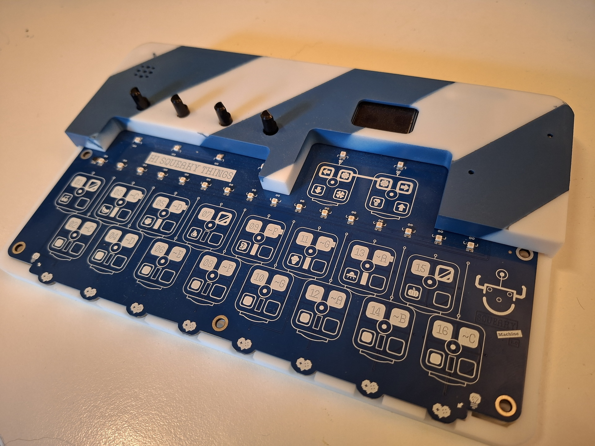
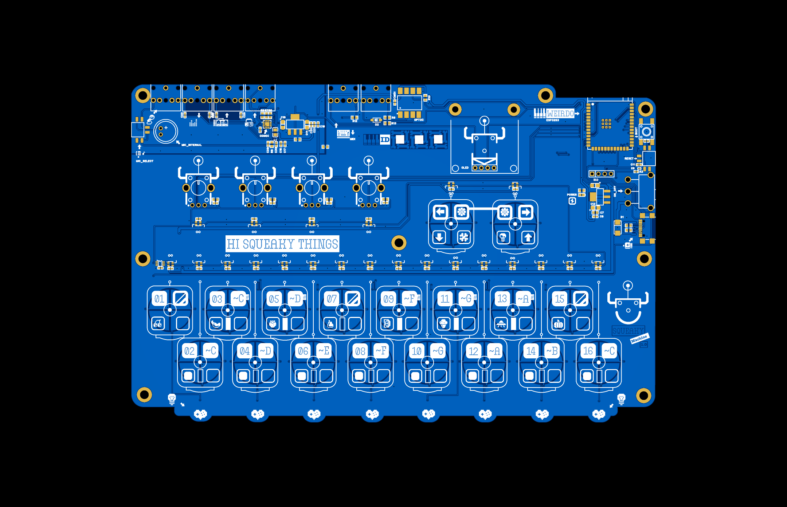

```
 ⡇ ⡇⢹⠁⢹⠁⡇ ⣏⡉ ⢎⡑⡎⢱⡇⢸⣏⡉⣎⣱⣇⠜⢇⢸ ⡷⢾⣎⣱⡎⠑⣇⣸⡇⡷⣸⣏⡉
 ⠧⠤⠇⠸ ⠸ ⠧⠤⠧⠤ ⠢⠜⠣⠪⠣⠜⠧⠤⠇⠸⠇⠱ ⠇ ⠇⠸⠇⠸⠣⠔⠇⠸⠇⠇⠹⠧⠤
```
[![CC BY-SA 4.0][cc-by-sa-shield]][cc-by-sa]

The Little Squeaky Machine is a hardware reference platform for the [Little Weirdo Software Synthesizer](https://github.com/hi-squeaky-things/little-weirdo). 


[cc-by-sa]: http://creativecommons.org/licenses/by-sa/4.0/
[cc-by-sa-image]: https://licensebuttons.net/l/by-sa/4.0/88x31.png
[cc-by-sa-shield]: https://img.shields.io/badge/License-CC%20BY--SA%204.0-lightgrey.svg

> [!CAUTION]
> This project is actively being developed with frequent breaking changes. Wires may shift, features are incomplete, and stability is not guaranteed. Use at your own risk and expect regular updates that might require SW/HW adjustments. Have fun!

> [!IMPORTANT]
> **Hi Squeaky Things** can happen at any time. _Little Squeaky Machine_ is ready to squeak, squuuueak, squeeeeeaak, squeaaaaaaaaak and drop some deep body shaking basses!

## Little Squeaky Machine Hardware

### Revision A

This is the first prototype we created and running a firmware using [Little Weirdo Software Synthesizer](https://github.com/hi-squeaky-things/little-weirdo) for sound synthesis. 





- [Specification and capabilities](design/specs.md)
- [Pin layout of the ESP32S3 based MCU](design/pinout.md)

## License

This work is licensed under a
[Creative Commons Attribution-ShareAlike 4.0 International License][cc-by-sa].

[![CC BY-SA 4.0][cc-by-sa-image]][cc-by-sa]

## Credits

