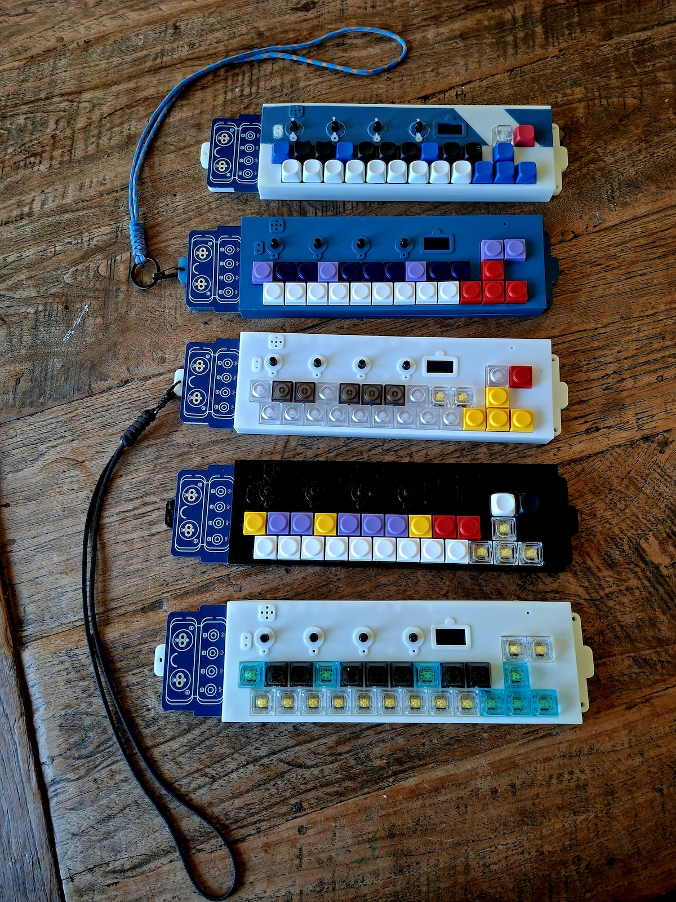
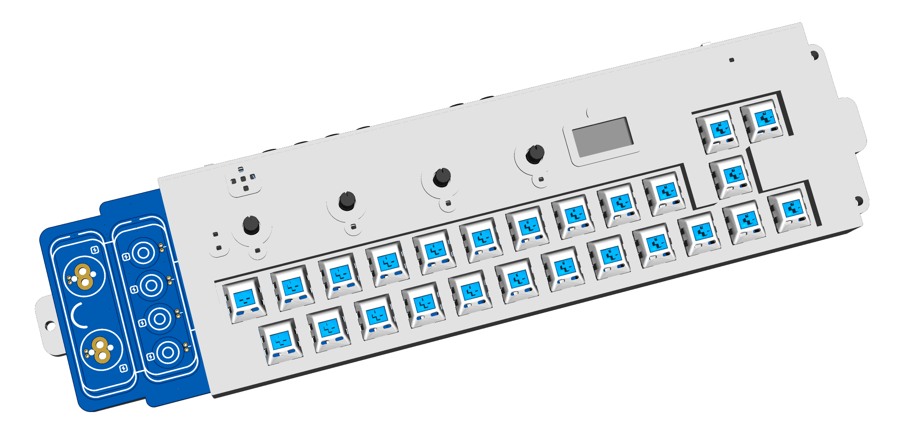
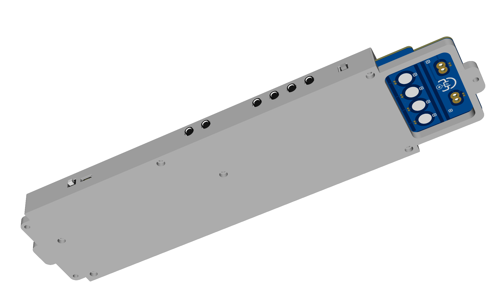
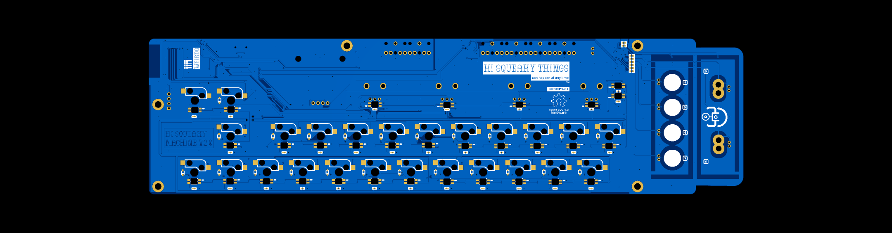
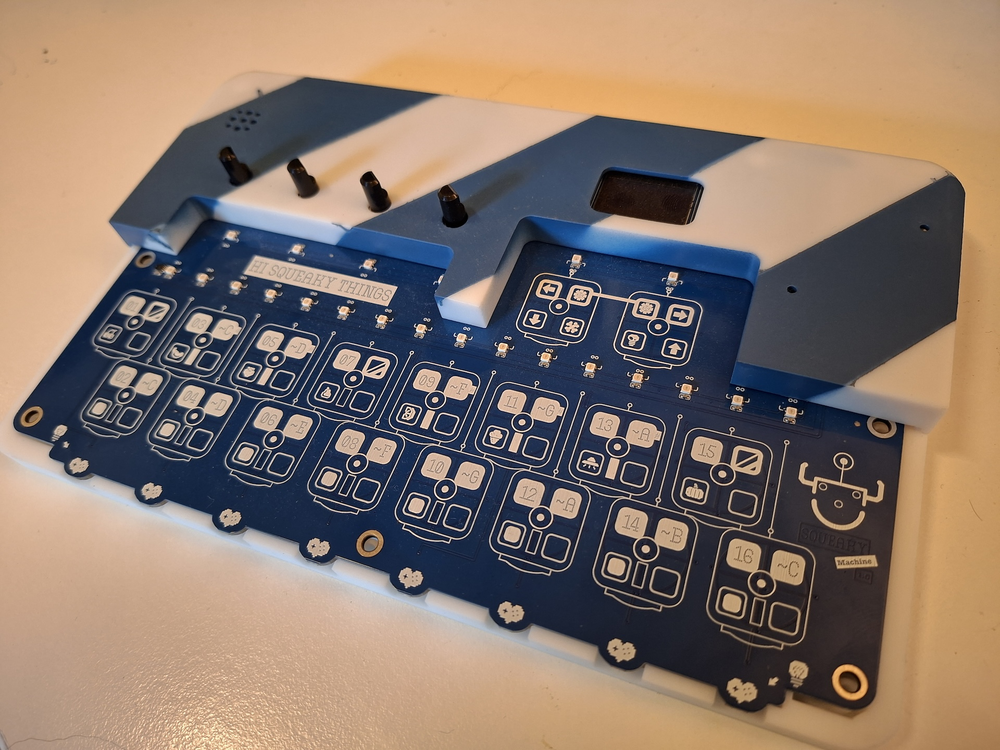
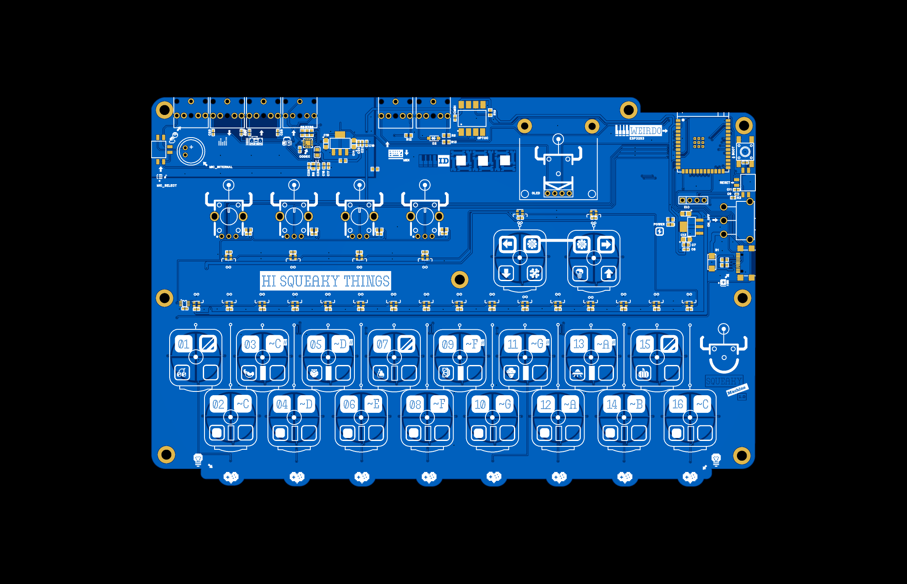

```
 ⡇ ⡇⢹⠁⢹⠁⡇ ⣏⡉ ⢎⡑⡎⢱⡇⢸⣏⡉⣎⣱⣇⠜⢇⢸ ⡷⢾⣎⣱⡎⠑⣇⣸⡇⡷⣸⣏⡉
 ⠧⠤⠇⠸ ⠸ ⠧⠤⠧⠤ ⠢⠜⠣⠪⠣⠜⠧⠤⠇⠸⠇⠱ ⠇ ⠇⠸⠇⠸⠣⠔⠇⠸⠇⠇⠹⠧⠤
```
[![CC BY-NC-SA 4.0][cc-by-nc-sa-shield]][cc-by-nc-sa]

The Little Squeaky Machine is a hardware reference platform for the [Little Weirdo Software Synthesizer](https://github.com/hi-squeaky-things/little-weirdo). 

Our first project is launching soon: our LttL Squeaky Machine! Put yourself on the list to get notified when we are ready to ship. 

[Join the waitinglist](https://www.hi-squeaky-things.nl/waiting-list)


[cc-by-nc-sa]: https://creativecommons.org/licenses/by-nc-sa/4.0/
[cc-by-nc-sa-image]: https://licensebuttons.net/l/by-nc-sa/4.0/88x31.png
[cc-by-nc-sa-shield]: https://img.shields.io/badge/License-CC%20BY--NC--SA%204.0-lightgrey.svg

> [!CAUTION]
> This project is actively being developed with frequent breaking changes. Wires may shift, features are incomplete, and stability is not guaranteed. Use at your own risk and expect regular updates that might require SW/HW adjustments. Have fun!

> [!IMPORTANT]
> **Hi Squeaky Things** can happen at any time. _Little Squeaky Machine_ is ready to squeak, squuuueak, squeeeeeaak, squeaaaaaaaaak and drop some deep body shaking basses!

## Little Squeaky Machine Hardware

The hardware is designed using EasyEDA. 

### Revision 2.0 

This is the first production ready hardware running a firmware using [Little Weirdo Software Synthesizer](https://github.com/hi-squeaky-things/little-weirdo) for sound synthesis. 

> [!CAUTION]
Small batch of this revision is fabricated. Use the schematics and layouts at your own risk because the new design is not fully tested yet. We are testing this revision with different types of key switches and caps and color. 



Rendered versions:





- [Specification and capabilities](design/specs.md)
- [Pin layout of the ESP32S3 based MCU](design/pinout.md)
- [Fabrication files](fabrication)





### Revision 1.0

This is the first prototype we created and running a firmware using [Little Weirdo Software Synthesizer](https://github.com/hi-squeaky-things/little-weirdo) for sound synthesis. This revision was only for a proof-of-concept some features and not for production use.





## License

This work is licensed under a
[Creative Commons Attribution-NonCommercial-ShareAlike 4.0 International License][cc-by-nc-sa].

[![CC BY-NC-SA 4.0][cc-by-nc-sa-image]][cc-by-nc-sa]

## Credits

Made by Daniël, owner of Hi Squeaky Things Lab.
